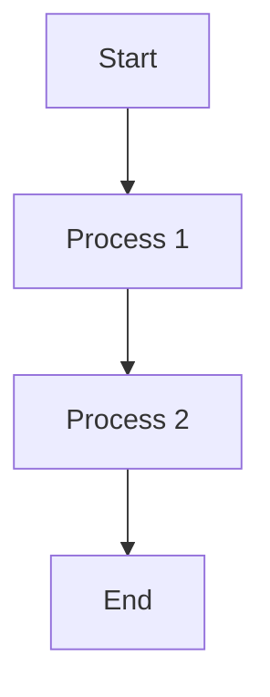
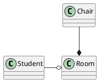

# pully

Used to explore pull request submits and merges.

This line was added by byerun on branch feature1.

2024-01-22-11-10 Making this change on branch4 if that's okay.

## Diagrams

```mermaid
flowchart TD;
    A[Start] --> B[Process 1];
    B --> C[Process 2];
    C --> D[End];
```

```plantuml
@startuml

Student -o Room
Chair --* Room

@enduml
```
 
